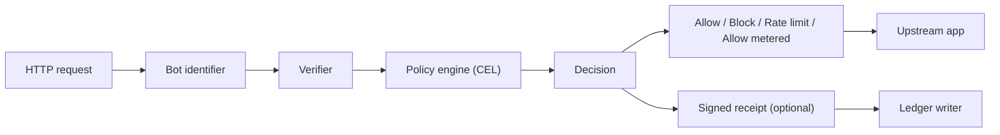

# CrawlWall: Caddy AI Crawler Access Control

[](https://pkg.go.dev/github.com/jolovicdev/crawlwall)
[](go.mod)
[](LICENSE)

> [!IMPORTANT]
> CrawlWall is alpha and experimental. It is useful for local testing, demos,
> and careful shadow-mode trials, but it is not yet a battle-tested production
> security boundary. Review the policy, verifier, and ledger behavior before
> enforcing blocks on real traffic.

A self-hosted Caddy module for AI crawler blocking, bot verification, rate
limiting, metered access, and signed crawl receipts. Block or rate-limit AI
crawlers such as GPTBot and ClaudeBot while still allowing verified search
engines such as Googlebot.

CrawlWall sits in front of your application and turns robots.txt-style crawler
policy into enforceable HTTP-edge rules using YAML and CEL. It identifies
crawlers, verifies their identity with reverse DNS or published IP ranges,
evaluates policy, records what happened, and can sign receipts for metered
access.

The short version is:

- `robots.txt` is advisory
- CrawlWall is enforcement
- YAML is the config container
- CEL is the policy language
- Caddy is the runtime

## Contents

- [Why this exists](#why-this-exists)
- [Supported crawlers](#supported-crawlers)
- [Mental model](#mental-model)
- [Architecture](#architecture)
- [How a request is handled](#how-a-request-is-handled)
- [Getting started](#getting-started)
- [Requirements](#requirements)
- [Keys and receipts](#keys-and-receipts)
- [Policy shape](#policy-shape)
- [Writing policy rules](#writing-policy-rules)
- [Verifiers](#verifiers)
- [Client IP and trusted proxies](#client-ip-and-trusted-proxies)
- [Actions](#actions)
- [CLI](#cli)
- [Project layout](#project-layout)
- [Scope](#scope)
- [Status](#status)
- [Help](#help)
- [License](#license)

## Why this exists

Sites increasingly need something more precise than:

- "please do not crawl this"
- "this bot says it is Google"
- "this path should maybe cost money"

That is awkward to express with `robots.txt`, awkward to audit in application
code, and annoying to keep consistent across services.

CrawlWall moves that logic into the HTTP edge and gives it a stable shape:

| Concern | CrawlWall answer |
| --- | --- |
| Is this crawler known? | Match on `User-Agent` |
| Is it really that crawler? | Verify by reverse DNS or IP ranges |
| What should happen? | Evaluate CEL rules in priority order |
| Need proof later? | Write a ledger event with a stable event ID |
| Need metering? | `allow_metered` + signed receipts |

The point is not to be clever. The point is to be explicit, inspectable, and
replaceable.

## Supported crawlers

CrawlWall ships no fixed blocklist. You declare the crawlers you care about in
policy and pick how each is verified. The ones people usually configure:

| Crawler | User-Agent contains | Verify by |
| --- | --- | --- |
| Googlebot | `Googlebot` | reverse DNS (`.googlebot.com`) |
| Bingbot | `bingbot` | reverse DNS (`.search.msn.com`) |
| GPTBot | `GPTBot` | published IP ranges |
| ChatGPT-User | `ChatGPT-User` | published IP ranges |
| OAI-SearchBot | `OAI-SearchBot` | published IP ranges |
| ClaudeBot | `ClaudeBot` | published IP ranges |
| PerplexityBot | `PerplexityBot` | published IP ranges |
| CCBot | `CCBot` | user agent only |
| Bytespider | `Bytespider` | user agent only |

Matching is a case-insensitive substring of the `User-Agent`. Verification is
what separates a real crawler from anything copying its user agent, so prefer
reverse DNS or IP ranges over user-agent-only matching where the operator
publishes them.

robots.txt-only tokens such as `Google-Extended` are advisory and never arrive
as a distinct fetcher, so they cannot be enforced at the edge. Configure the
actual fetch user agents instead.

## Mental model

Think of CrawlWall as four subsystems glued together inside a Caddy handler:

1. **Bot identification**: map a request to a known bot definition or `unknown`.
2. **Verification**: decide whether the claimed crawler identity is trustworthy.
3. **Policy evaluation**: run CEL rules against the request context.
4. **Audit trail**: write the event and optionally sign a receipt.

That means the project is not "a YAML parser" and not "a crawler blocklist."
It is a policy runtime.

## Architecture



The startup path matters as much as the request path.

At startup CrawlWall:

1. loads `crawlwall.yaml`
2. validates the config
3. compiles CEL expressions
4. opens the ledger backend
5. prepares verifiers
6. loads the receipt signer

If a CEL expression is broken, startup should fail. That is the right pain
location.

## How a request is handled

| Step | What happens |
| --- | --- |
| 1 | Read `User-Agent` and identify the claimed crawler |
| 2 | Verify the request source according to that crawler's verifier |
| 3 | Build the policy input: `bot`, `request`, `site`, `sets`, `labels` |
| 4 | Evaluate rules by ascending priority |
| 5 | Enforce the first matching action |
| 6 | If requested, sign a receipt over the stable event ID |
| 7 | Write one ledger record containing the decision and receipt metadata |

The policy input is intentionally small and boring. It is easier to extend a
plain model than to untangle a magical one.

## Getting started

Do not start from a blank file.

This repo ships with two starter policies:

| File | Use it when |
| --- | --- |
| [`examples/minimal.yaml`](./examples/minimal.yaml) | You want a readable starter with no receipt signing |
| [`examples/full.yaml`](./examples/full.yaml) | You want the full V1 shape with metering and signed receipts |
| [`examples/policy-fixtures.yaml`](./examples/policy-fixtures.yaml) | You want regression tests for policy behavior |

There is also a scaffold command:

```sh
go run ./cmd/crawlwall init --profile minimal
go run ./cmd/crawlwall init --profile full
```

That writes:

- `crawlwall.yaml`
- `Caddyfile`
- `.gitignore`
- `crawlwall.key` and `crawlwall.pub` unless you disable key generation

If you want the scaffold without keys yet:

```sh
go run ./cmd/crawlwall init --profile minimal --generate-keys=false
```

## Requirements

- Go matching the version in [`go.mod`](./go.mod)
- `xcaddy` to build a Caddy binary with the CrawlWall module
- Caddy for config validation and runtime
- A SQLite ledger path when `ledger.enabled` is `true`

### Build

Build a custom Caddy binary with `xcaddy`.

From this local checkout:

```sh
go mod tidy
xcaddy build --with github.com/jolovicdev/crawlwall=.
```

From a published module version:

```sh
xcaddy build --with github.com/jolovicdev/crawlwall@latest
```

Check that the module is present:

```sh
caddy list-modules | grep crawlwall
```

Validate the config:

```sh
go run ./cmd/crawlwall policy check --config ./crawlwall.yaml
caddy validate --config ./Caddyfile --adapter caddyfile
```

Run it:

```sh
caddy run --config ./Caddyfile --adapter caddyfile
```

Try a few requests:

```sh
curl http://localhost:8080/
curl http://localhost:8080/archive/a
curl -A "GPTBot/1.1" http://localhost:8080/archive/a
```

> [!NOTE]
> The docs use plain executable names on purpose. Use whatever binary name your
> environment produces.

## Keys and receipts

Receipt signing uses Ed25519.

The private key is sensitive and should never be committed. This repo ignores
it by default in [`.gitignore`](./.gitignore).

You have two normal ways to create keys:

1. let `crawlwall init` generate them
2. generate them yourself with `openssl`

```sh
openssl genpkey -algorithm Ed25519 -out crawlwall.key
openssl pkey -in crawlwall.key -pubout -out crawlwall.pub
```

Receipt config looks like this:

```yaml
receipts:
  enabled: true
  signer:
    type: ed25519
    key_file: ./crawlwall.key
```

Receipts are for proving what decision was made for a request. In V1 they are
used for metered access and audit, not settlement.

## Policy shape

The top-level config model is stable even if the individual rules change:

| Section | Purpose |
| --- | --- |
| `site` | Site identity and mode |
| `runtime` | Failure behavior and default action |
| `ledger` | Event recording settings |
| `receipts` | Receipt signer configuration |
| `bots` | Known crawler definitions and verifier settings |
| `sets` | Reusable policy data |
| `rules` | CEL expressions plus actions |

`site.mode` controls enforcement:

| Mode | Effect |
| --- | --- |
| `shadow` | Log decisions without enforcing blocks or rate limits |
| `observe` | Alias for `shadow`, kept for older configs |
| `enforce` | Enforce policy decisions |

Use `shadow` before blocking crawlers on a production site. It lets you inspect
the ledger first, which is less exciting than debugging a self-inflicted 403
storm.

## Writing policy rules

Start with the [policy guide](./docs/policy-guide.md). It explains the available
CEL inputs, rule priority, shadow mode, common recipes, verifier cache status,
and fixture tests.

### Example Caddyfile

```caddyfile
{
  order crawlwall before reverse_proxy
}

:8080 {
  crawlwall {
    policy ./crawlwall.yaml
    ledger sqlite://./crawlwall.db
    fail_mode block
  }

  reverse_proxy localhost:3000
}
```

### Example rule

```yaml
- id: meter_training_on_protected_paths
  priority: 200
  when: >
    bot.verified &&
    bot.class == "ai_training" &&
    sets.protected_paths.exists(p, request.path.startsWith(p))
  action:
    type: allow_metered
    price:
      amount: 0.002
      currency: USD
      unit: request
  audit:
    receipt: true
    tags: ["ai_training", "metered"]
```

### Example config

Full V1 policy example:

```yaml
version: crawlwall.io/v1

site:
  id: local-dev
  host: localhost
  mode: enforce

runtime:
  fail_mode: block
  default_action:
    type: allow

ledger:
  enabled: true

receipts:
  enabled: true
  signer:
    type: ed25519
    key_file: ./crawlwall.key

bots:
  - id: googlebot
    name: Googlebot
    class: search
    match:
      user_agents:
        - "Googlebot"
    verify:
      type: reverse_dns
      allowed_suffixes:
        - ".googlebot.com"
        - ".google.com"

  - id: gptbot
    name: GPTBot
    class: ai_training
    match:
      user_agents:
        - "GPTBot"
    verify:
      type: ip_ranges
      sources:
        - "https://openai.com/gptbot.json"
      refresh: 1h
      stale_action: fail_closed
      max_stale: 0s

  - id: unknown
    name: Unknown
    class: unknown
    match:
      default: true
    verify:
      type: none

sets:
  protected_paths:
    - "/archive"
    - "/datasets"
    - "/reports"

  known_ai_training:
    - "gptbot"
    - "claudebot"

rules:
  - id: block_spoofed_known_bots
    priority: 10
    when: >
      bot.claimed && !bot.verified
    action:
      type: block
      status: 403
      reason: spoofed_bot
    audit:
      receipt: true
      tags: ["spoofed", "security"]

  - id: allow_verified_search
    priority: 100
    when: >
      bot.verified && bot.class == "search"
    action:
      type: allow
    audit:
      receipt: false
      tags: ["search"]

  - id: meter_training_on_protected_paths
    priority: 200
    when: >
      bot.verified &&
      bot.class == "ai_training" &&
      sets.protected_paths.exists(p, request.path.startsWith(p))
    action:
      type: allow_metered
      price:
        amount: 0.002
        currency: USD
        unit: request
    audit:
      receipt: true
      tags: ["ai_training", "metered"]

  - id: rate_limit_ai_training_elsewhere
    priority: 300
    when: >
      bot.verified && bot.class == "ai_training"
    action:
      type: rate_limit
      limit:
        key: "bot.id"
        rpm: 120
    audit:
      receipt: true
      tags: ["ai_training"]

  - id: block_unknown_protected_paths
    priority: 900
    when: >
      bot.class == "unknown" &&
      sets.protected_paths.exists(p, request.path.startsWith(p))
    action:
      type: block
      status: 403
      reason: unknown_crawler_protected_path
    audit:
      receipt: true
      tags: ["unknown", "blocked"]
```

## Verifiers

V1 ships with three verifier types:

| Verifier | What it means |
| --- | --- |
| `none` | No verification step; useful for the `unknown` catch-all bot |
| `reverse_dns` | Verify by PTR lookup and forward-confirm the result |
| `ip_ranges` | Verify by matching the request IP against fetched CIDR ranges |

### `reverse_dns`

This is the standard pattern used for bots like Googlebot:

1. resolve remote IP to PTR names
2. require a configured suffix match
3. resolve the PTR hostname back to A/AAAA
4. require the original IP to be present

Completed reverse-DNS decisions are cached per IP for five minutes to avoid
doing PTR and forward lookups on every request from a claimed crawler.

### `ip_ranges`

This is the simpler model for bots that publish source ranges:

1. fetch remote JSON
2. extract CIDRs
3. cache them in memory
4. refresh on the configured interval
5. match the request IP against the cache

> [!IMPORTANT]
> A `GPTBot` request only verifies as `true` if the actual source IP falls
> inside OpenAI's published GPTBot ranges at evaluation time.

There is one unavoidable freshness tradeoff: CrawlWall can only know about an
IP range rotation after it refreshes the provider document. A shorter
`refresh` reduces that window but makes more network calls.

When a refresh is due and the provider document cannot be fetched,
`stale_action` controls whether the expired cache is still trusted:

| Field | Default | Meaning |
| --- | --- | --- |
| `refresh` | `12h` | How often to refetch the range document |
| `stale_action` | `fail_closed` | Refuse expired ranges after refresh failure |
| `max_stale` | `0s` | Extra stale-cache time for `use_stale` |

Security-first config:

```yaml
verify:
  type: ip_ranges
  sources:
    - "https://openai.com/gptbot.json"
  refresh: 1h
  stale_action: fail_closed
  max_stale: 0s
```

Availability-first config:

```yaml
verify:
  type: ip_ranges
  sources:
    - "https://openai.com/gptbot.json"
  refresh: 1h
  stale_action: use_stale
  max_stale: 24h
```

Use `fail_closed` when spoof resistance matters more than crawler availability.
Use `use_stale` only when temporarily blocking a legitimate crawler is worse
than trusting a bounded stale range cache.

## Client IP and trusted proxies

CrawlWall verifies crawlers against Caddy's trusted-proxy-aware client IP. If
Caddy receives traffic directly, that is the socket remote address. If Caddy is
behind a CDN, load balancer, or reverse proxy, configure Caddy's server-level
`trusted_proxies` and `client_ip_headers` options so forwarded client IP headers
are trusted only from known proxy ranges.

Example:

```caddyfile
{
  servers {
    trusted_proxies static private_ranges
    client_ip_headers X-Forwarded-For CF-Connecting-IP
  }

  order crawlwall before reverse_proxy
}
```

Do not trust arbitrary `X-Forwarded-For` headers from the public internet. That
turns crawler verification into wishful thinking with a header parser.

## Actions

V1 supports four actions:

| Action | Effect |
| --- | --- |
| `allow` | Let the request pass |
| `block` | Return an error response immediately |
| `rate_limit` | Allow within a configured rate, then return `429` |
| `allow_metered` | Allow the request and record pricing metadata |

`allow_metered` is intentionally narrow. It does not try to settle payment,
issue invoices, or do 402 handshakes. It records the metering event and signs a
receipt so that payment can be built later without changing the core decision
engine.

## CLI

The CLI exists to make policy iteration less miserable:

```sh
go run ./cmd/crawlwall init --profile minimal
go run ./cmd/crawlwall policy check --config ./crawlwall.yaml
go run ./cmd/crawlwall policy eval \
  --config ./crawlwall.yaml --ua "GPTBot/1.1" \
  --path "/archive/a" --ip 20.125.66.81
go run ./cmd/crawlwall policy test \
  --config ./crawlwall.yaml --fixtures ./examples/policy-fixtures.yaml
go run ./cmd/crawlwall verifiers status --config ./crawlwall.yaml
go run ./cmd/crawlwall ledger report --db ./crawlwall.db --since 24h
go run ./cmd/crawlwall ledger export --db ./crawlwall.db --format jsonl
go run ./cmd/crawlwall ledger vacuum --db ./crawlwall.db --older-than 30d
go run ./cmd/crawlwall receipts verify \
  --file ./ledger-export.jsonl --public-key ./crawlwall.pub
```

Useful split:

- `init`: create a starting point
- `policy check`: validate and compile
- `policy eval`: answer "what would happen to this request?"
- `policy test`: run fixture-based policy regression tests
- `verifiers status`: show IP range verifier cache health
- `ledger report`: summarize observed traffic
- `ledger export`: dump the event log
- `ledger vacuum`: delete old events and compact the SQLite file
- `receipts verify`: validate signed receipt output

## Project layout

```text
cmd/crawlwall/         CLI
docs/                  usage guides
examples/              starter policies
internal/bot/          user-agent matching and bot registry
internal/config/       YAML load and validation
internal/ledger/       ledger interface and SQLite backend
internal/policy/       CEL environment, compile, evaluate
internal/ratelimit/    in-memory limiter
internal/receipt/      canonical receipts and Ed25519 signing
internal/scaffold/     starter templates for init
internal/verify/       reverse DNS and IP range verifiers
```

The main interface worth caring about is the ledger boundary. Request handling
depends only on an `EventWriter` contract: one fully-formed event in, storage
error out. Reporting and export are separate interfaces, so a Postgres,
webhook, or queue-backed writer does not have to pretend it is SQLite.

## Scope

Included in V1:

- Caddy handler
- CEL policy engine
- reverse DNS verification
- IP range verification
- verifier cache status checks
- shadow mode for dry-run policy rollout
- SQLite ledger
- ledger retention cleanup
- signed receipts
- local reporting and export
- policy fixture tests

Deliberately not included in V1:

- payment processing
- dashboards
- distributed quotas
- extra webserver integrations
- policy languages beyond CEL

## Status

The current implementation has been exercised with:

- `go test ./...`
- custom Caddy builds through `xcaddy`
- Caddy config validation
- live requests through Caddy to a local upstream
- verifier cache status checks
- policy fixture tests
- ledger export
- receipt verification
- integration tests for blocked, shadowed, metered, and rate-limited flows

That means the current claim is modest but honest:

> CrawlWall is a self-hosted Caddy crawler access-control layer. It identifies
> bots, verifies identity, evaluates CEL policy rules, enforces
> allow/block/rate-limit/metered decisions, stores a crawler ledger, and
> exports signed crawl receipts.

## Help

Use [GitHub Issues](https://github.com/jolovicdev/crawlwall/issues) for bugs,
security-relevant behavior questions, and integration reports. Include the
Caddyfile, CrawlWall policy, request path, user agent, and observed ledger row
when possible.

## License

MIT. See [`LICENSE`](./LICENSE).

## Inspiration

Cloudflare's pay-per-crawl docs were useful inspiration for separating metering
from payment, but CrawlWall stays much smaller and self-hosted:

- [What is pay per crawl?](https://developers.cloudflare.com/ai-crawl-control/features/pay-per-crawl/what-is-pay-per-crawl/)
